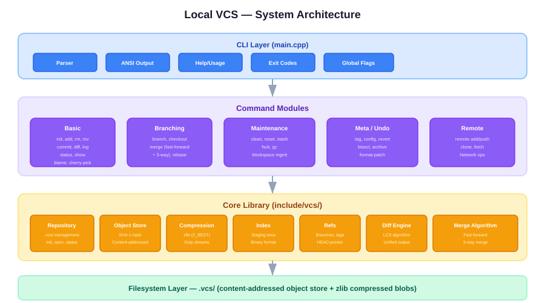

<p align="center">
  
</p>

# Local Version Control System

A lightweight Git-like version control system implemented in C++17 with no external dependencies beyond the standard library and zlib.

<p align="center">
  
  
  
  
</p>

---

## Object Storage Pipeline

<p align="center">
  
</p>

---

## Features

- **Repository management**: `init`, `status`
- **File tracking**: `add`, `rm`, `mv`, `clean`
- **Committing**: `commit` (with `--amend`)
- **Branching**: `branch`, `checkout`, `merge` (fast-forward + 3-way)
- **History**: `log` (with `--oneline`, `--graph`), `diff`, `show`
- **Undo**: `revert`, `stash` (push/pop/list)
- **Metadata**: `tag`, `config`, `revert`
- **Color-coded CLI** with ANSI escape sequences
- **Content-addressed storage** with SHA-1 hashing and zlib compression

## Build

### Prerequisites
- C++17 compiler (GCC, Clang, MSVC)
- zlib development headers/libraries (`-lz`)

### Compile
```sh
g++ -std=c++17 -Iinclude src/main.cpp src/basic/*.cpp src/branching/*.cpp src/maintenance/*.cpp src/meta/*.cpp -lz -o vcs
```

## Usage

```sh
# Initialize
vcs init

# Stage files
vcs add file.txt

# Commit
vcs commit -m "message"

# History
vcs log
vcs log --oneline --graph

# Branches
vcs branch feature
vcs checkout feature
vcs merge feature

# Undo
vcs revert <commit>
vcs stash push -m "WIP"
vcs stash pop

# Diff
vcs diff
vcs diff --staged
vcs diff <commit1> <commit2>

# Config
vcs config user.name "Your Name"
vcs config --list
```

## Project Structure

```
├── include/vcs/       — header-only library (core logic)
├── src/
│   ├── main.cpp       — CLI entry point
│   ├── basic/         — fundamental commands
│   ├── branching/     — branch management
│   ├── maintenance/   — file & workspace management
│   └── meta/          — metadata & undo
└── .vcs/              — repository metadata (created at init)
```

## Architecture

- **Content-addressed**: Objects stored as `sha1( type + size + content )` → `objects/ab/cdef1234...`
- **Compression**: All objects compressed with zlib (`Z_BEST_SPEED`)
- **Index**: Staging area stored in `.vcs/index`
- **Refs**: Branch/tag pointers in `.vcs/refs/heads/` and `.vcs/refs/tags/`
- **SHA-1**: Custom inline implementation (no OpenSSL dependency)
- **Cross-platform**: Uses `std::filesystem` for POSIX/Windows support
